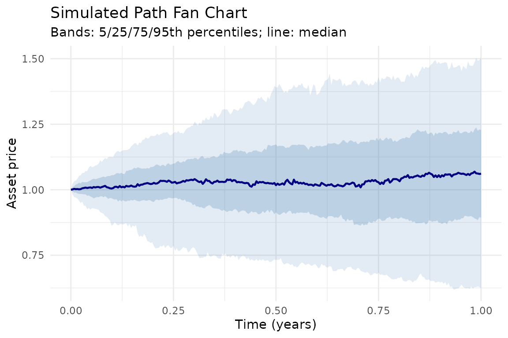
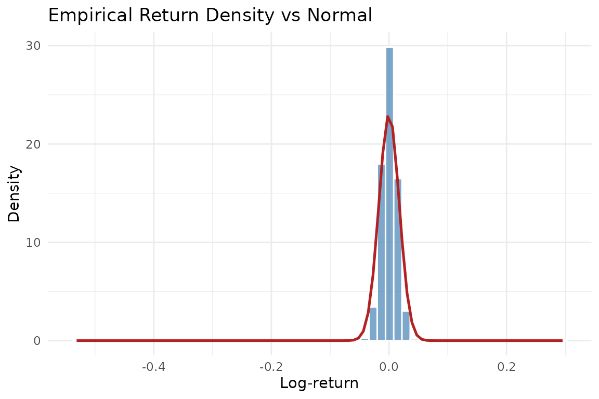

# Getting Started with JumpDiffSim

## 1. Why Jump-Diffusion?

Standard Geometric Brownian Motion (GBM) assumes that log-returns are
normally distributed. Empirical equity and cryptocurrency returns,
however, exhibit well-documented departures from normality:

- **Leptokurtosis** (excess kurtosis \> 0): more mass in the centre and
  tails than a Normal distribution predicts.
- **Negative skewness**: large negative moves are more common and more
  severe than large positive moves.

The **Merton (1976)** jump-diffusion model adds a compound Poisson
process to GBM, allowing the price to jump discontinuously at random
times:

$$dS_{t} = S_{t}\left\lbrack \left( \mu - \lambda{\bar{\mu}}_{J} \right)\, dt + \sigma\, dW_{t} + dJ_{t} \right\rbrack$$

where $J_{t} = \sum_{i = 1}^{N{(t)}}\left( Y_{i} - 1 \right)$,
$N(t) \sim \text{Poisson}(\lambda t)$, and
$\log Y_{i} \sim \mathcal{N}\left( \mu_{J},\sigma_{J}^{2} \right)$.

**JumpDiffSim** provides a clean, unified S4 interface for simulating
paths and calibrating parameters under this model, with all examples
running entirely offline.

------------------------------------------------------------------------

## 2. Simulate Paths

``` r
library(JumpDiffSim)

# Create a MertonModel S4 object with default parameters
m <- MertonModel(
  mu      =  0.05,   # drift
  sigma   =  0.20,   # diffusion volatility
  lambda  =  1,      # average jumps per year
  mu_j    = -0.10,   # mean log-jump size
  sigma_j =  0.15    # std dev of log-jumps
)

# Display the model
show(m)
#> Merton Jump-Diffusion Model
#> ---------------------------
#>   mu      : 0.0500
#>   sigma   : 0.2000
#>   lambda  : 1.0000
#>   mu_j    : -0.1000
#>   sigma_j : 0.1500
#>   Persist : 0.2500  [alpha+beta not applicable to raw model]

# Simulate 200 paths over 1 year with 252 daily steps
sim <- simulateMerton(m, n = 200, T_ = 1, steps = 252, seed = 42)

# Diagnostic plots
plts <- diagnosticPlots(sim)
print(plts$fan_chart)
```



``` r
print(plts$density)
```



The fan chart shows the 5th, 25th, 50th, 75th, and 95th percentile bands
of the 200 simulated paths. The density plot overlays the empirical
return histogram against a Normal curve, illustrating the heavy-tailed
character of Merton returns.

------------------------------------------------------------------------

## 3. Fit Model to Data

``` r
# Generate reproducible synthetic log-returns
# (all examples use jdSampleData() -- no internet required)
ret <- jdSampleData("merton", n = 500, seed = 42)

# Fit the Merton model via Maximum Likelihood Estimation
fit <- fitMerton(ret, verbose = FALSE)

# Parameter estimates and convergence
print(fit)
#> Merton MLE Fit Result
#> ---------------------
#>   Converged : TRUE
#>   Log-lik   : 1464.8117
#>   Estimates (SE):
#>     mu       :   0.0889  (     NaN)
#>     sigma    :   0.2022  (     NaN)
#>     lambda   :   0.5040  (     NaN)
#>     mu_j     :   0.0801  (     NaN)
#>     sigma_j  :   0.0000  (     NaN)

# 95% Wald confidence intervals
confint(fit)
#>         2.5 % 97.5 %
#> mu        NaN    NaN
#> sigma     NaN    NaN
#> lambda    NaN    NaN
#> mu_j      NaN    NaN
#> sigma_j   NaN    NaN
```

The
[`fitMerton()`](https://kennedy2244.github.io/JumpDiffSim/reference/fitMerton.md)
function uses L-BFGS-B optimisation and computes Hessian-based standard
errors via
[`numDeriv::hessian()`](https://rdrr.io/pkg/numDeriv/man/hessian.html).
The `converged` slot confirms whether the optimiser reached a solution.

------------------------------------------------------------------------

## 4. Interpreting Parameters

| Parameter | Meaning                            |
|-----------|------------------------------------|
| mu        | Drift (expected continuous return) |
| sigma     | Diffusion volatility               |
| lambda    | Average jumps per year             |
| mu_j      | Average log-size of each jump      |
| sigma_j   | Std deviation of jump sizes        |

A **negative** `mu_j` combined with a positive `lambda` implies that
jumps on average reduce the asset price — consistent with the crash-risk
interpretation of Merton (1976).

------------------------------------------------------------------------

## 5. Theoretical Moments

``` r
# Theoretical mean, variance, skewness, and excess kurtosis
# contributed by the jump component
jumpMoments(m)
#>       mean   variance   skewness   kurtosis 
#>  0.0300000  0.0725000 -0.3970038  0.5648038
```

Excess kurtosis greater than zero confirms that the Merton model
generates heavier tails than GBM, which is the key motivation for using
a jump-diffusion specification.

------------------------------------------------------------------------

## References

- Merton, R.C. (1976). Option pricing when underlying stock returns are
  discontinuous. *Journal of Financial Economics*, 3(1-2), 125-144.
- Wickham, H. and Bryan, J. (2023). *R Packages* (2nd ed.). O’Reilly
  Media. <https://r-pkgs.org/>
